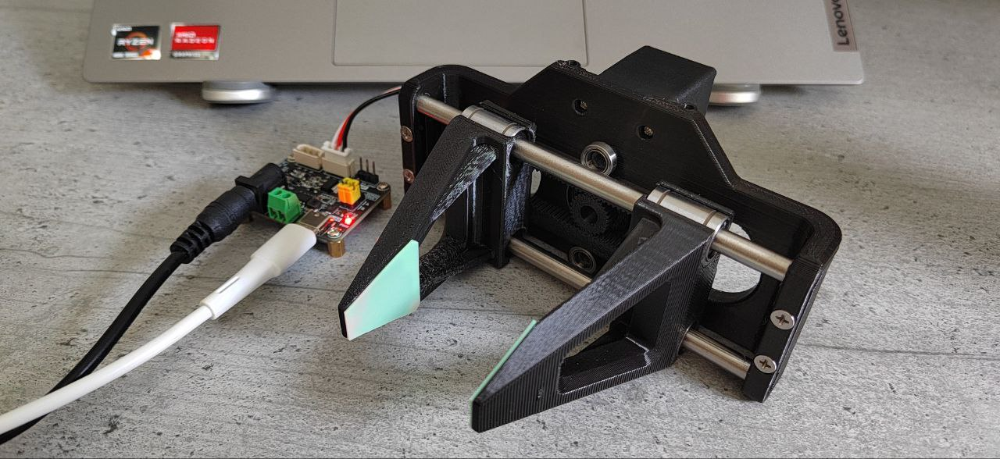
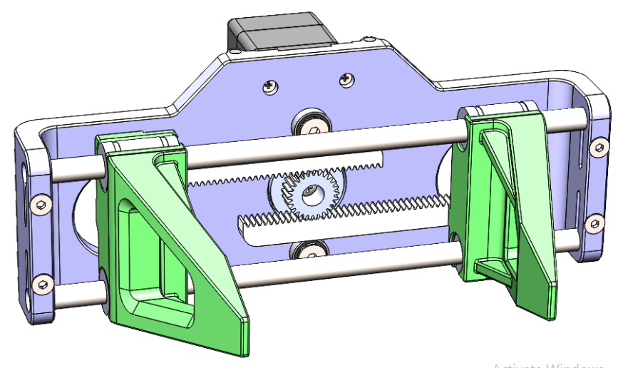

# Open-Source 3D-Printed Parallel Gripper for Robotics Arms

A precision parallel gripper designed by [Robonine](https://robonine.com) for robotics applications, featuring 3D-printed components and professional servo control using Feetech STS3215 servos.

---

<div align="center">

**Questions? We're here to help!**  
📩 Email: [hello@robonine.com](mailto:hello@robonine.com)

</div>

---

## 📸 Gallery

<div align="center">

### Assembled Gripper

*Real-world implementation of the gripper*

### 3D CAD Design

*3D CAD design showing internal mechanism*

### 🎥 See It in Action
[](https://youtube.com/shorts/Ss4TbO_psto?si=v6VbK91Q2vyNlbNd)

*Click above to see the parallel gripper working with precise control and smooth operation*

</div>

## 💰 Total Project Cost

**Complete Build Cost: $69.45-74.45** *(Amazon pricing)*

| Category | Cost (USD) |
|----------|------------|
| Electronic Components | $39.98 |
| Mechanical Components | $22.87 |
| 3D Printing Materials | $5-10 |
| Fasteners | $1.60 |
| **Total** | **$69.45-74.45** |

*All components available on Amazon with direct purchase links in [Bill of Materials](docs/bom-amazon.md)*

## 🎯 Project Overview

This project provides a complete open-source solution for a parallel gripper that can be integrated with robotic arms. The gripper features:

- **Precision Control**: Servo-driven parallel jaw mechanism with real-time feedback
- **Professional Design**: Industrial-grade part numbering and assembly procedures
- **Cost-Effective**: 3D-printed components with readily available hardware
- **Versatile Integration**: Compatible with various robotics platforms

## 🔧 Key Features

- **Parallel Jaw Movement**: Ensures consistent grip on objects of various sizes
- **Real-time Monitoring**: Current, voltage, temperature, and load feedback
- **Precise Positioning**: Degree-based control with position feedback (±0.1°)
- **Robust Construction**: Linear bearings for smooth, reliable operation
- **Professional Design**: CAD design with industrial-grade components
- **Servo Control**: High-torque Feetech STS3215 with bus communication
- **3D Printable**: All mechanical parts designed for standard FDM printers
- **Open Source**: Complete documentation, code, and CAD files included

## 📋 Specifications

- **Servo**: Feetech STS3215 (compatible with Waveshare variants)
- **Communication**: Serial (RS485/TTL, up to 1Mbps)
- **Power**: 6-12V DC
- **Jaw Travel**: Configurable based on gear ratio
- **Materials**: PLA/PETG 3D printed parts, steel rods, precision bearings
- **Positioning Accuracy**: ±0.1° (4096 steps/360°)
- **Force**: Up to 15kg·cm servo torque
- **Response Time**: <100ms for small movements

## 🎯 Performance Highlights

✅ **Smooth Operation** - Linear bearings ensure frictionless movement  
✅ **Precise Control** - Degree-based positioning with real-time feedback  
✅ **Reliable Gripping** - Parallel jaws maintain consistent contact  
✅ **Professional Integration** - Bus communication for robotics systems  
✅ **Proven Design** - Tested and demonstrated in real applications

## 🛠️ Hardware Requirements

### Electronic Components
- 1x Feetech STS3215-C018 Servo Motor or Waveshare STS3215
- 1x Bus Servo Adapter Board (Waveshare or compatible)

### Mechanical Components
- 2x MR106ZZ Bearings (10x6x3 mm)
- 4x LM6UU Linear Bearings (12x6x19 mm)
- 2x Stainless Steel Rods (6mm diameter, 150mm length)

### 3D-Printed Parts
- 1x Main Frame (RB9.01.060.010)
- 2x Clamps (RB9.01.060.020)
- 2x Gear Racks (RB9.01.060.030)
- 1x Drive Gear (RB9.01.060.040)

### Fasteners
- 4x M3x10 DIN 7991 screws
- 4x M3x20 DIN 7991 screws
- 2x M4x8 DIN 7991 screws
- 4x M3 DIN 934 nuts
- 4x Self-tapping screws (included with servo)

## 🚀 Quick Start

1. **Print the Parts**: Use the STL files in `/hardware/3d-models/`
2. **Gather Components**: Order parts from the [Bill of Materials](docs/bom.md)
3. **Assembly**: Follow the [Assembly Guide](docs/assembly-guide.md)
4. **Software Setup**: 
   - Download and install the STServo SDK:
     - Download [STServo Python SDK](https://files.waveshare.com/wiki/Bus-Servo-Adapter-(A)/STServo_Python.zip)
     - Extract the ZIP file and copy the `STservo_sdk` folder to `software/python/` directory
   - Install Python dependencies and run the control software:

```bash
pip install -r software/python/requirements.txt
python software/python/gripper_control.py
```

## 📁 Repository Structure

```
├── docs/                    # Documentation
│   ├── assembly-guide.md   # Step-by-step assembly
│   ├── bom.md             # Bill of materials
│   └── specifications.md   # Technical specifications
├── hardware/
│   └── 3d-models/         # STL files for 3D printing
├── software/
│   └── python/            # Control software
└── examples/              # Usage examples
```

## 🤝 Contributing

We welcome contributions! Please see our contributing guidelines for:
- Bug reports and feature requests
- Code contributions
- Documentation improvements
- Hardware modifications

## 📄 License

This project is licensed under the GPL-3.0 license - see the [LICENSE](LICENSE) file for details.

## 🔗 Links

- [Feetech STS3215 Servo](https://www.feetechrc.com/525603.html)
- [Waveshare Bus Servo Adapter](https://www.waveshare.com/bus-servo-adapter-a.htm)
- [Project Documentation](docs/)

## 📞 Support

For questions and support:
- Open an issue on GitHub
- Check the documentation in `/docs/`
- Review the examples in `/examples/`

---

<div align="center">

**Built for the robotics community by [Robonine](https://robonine.com)** 🤖

**Questions? We're here to help!**  
📩 Email: [hello@robonine.com](mailto:hello@robonine.com)

</div>
